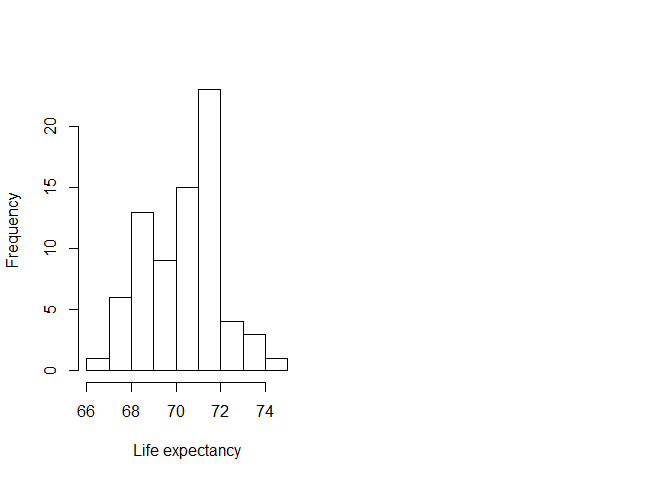
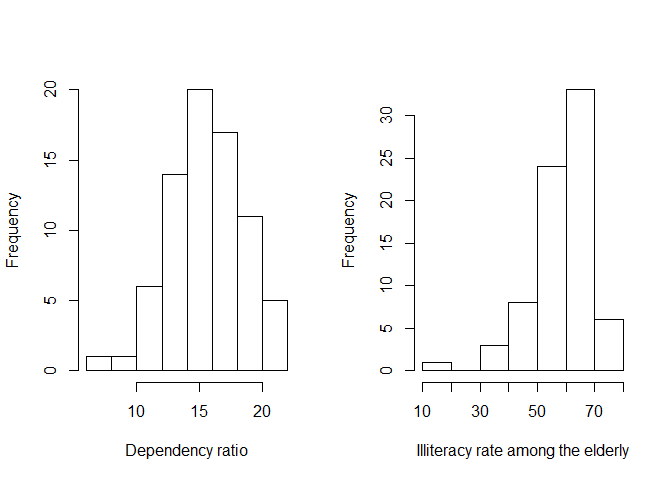
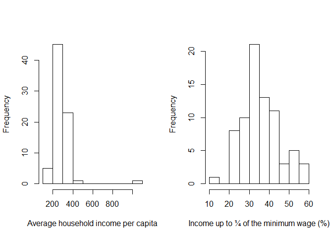
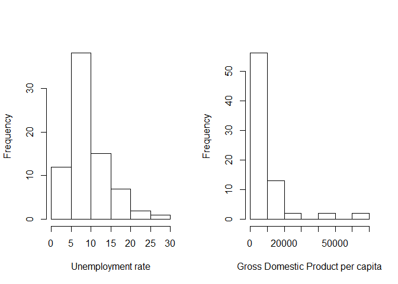
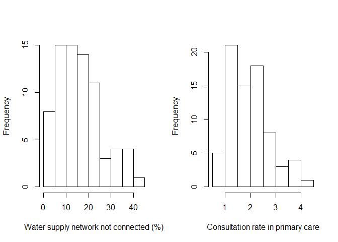
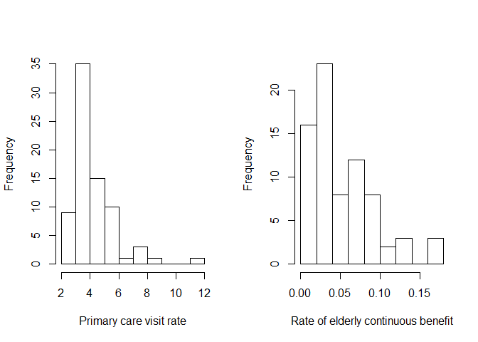

# Health analytics - Social Determinants and Life Expectancy in the Elderly
Marco Antonio Prado Nunes and Andrezza Marques Duque  
29 de junho de 2017  


### Contacts:

Marco Antonio Prado Nunes MD PhD  
University Hospital/ Federal University of Sergipe  
Aracaju, Sergipe, Brazil  
Email: nunes.ma@ufs.br  
linkedin: https://www.linkedin.com/in/marco-nunes-538a8b57


## Introduction:

Population aging is a global reality and has been considered a challenge for health systems. In Brazil, aging has complex dimensions due to the velocity with which it is occurring and is causing social and health impacts. For this reason, the planning of public policies adapted to these new challenges is so necessary.

## Objective:

This project intends to evaluate the influence of some social and economic indicators on life expectancy, aiming to establish elements for the planning of public policies related to the health care of the elderly population.

## Method:

This was an ecological study of the 75 municipalities that are part of the State of Sergipe, located in the Northeast region of Brazil and has a population of 2,068,017 inhabitants, of which 8.9% (185,957) are 60 years of age or older.

In this evaluation the social, demographic and health indicators were analyzed and were collected through the Information System of the Ministry of Health (DATASUS) and the Brazilian Institute of Geography and Statistics (IBGE) through the Brazilian Demographic Census at the level of disaggregation of the sectors Censuses. Elderly persons were those aged 60 or over, according to Brazilian legislation.

Indicators analyzed - Social Determinants:  
o	Dependent variable  
01.	lifeExpec - Life expectancy  
o	Independent variable  
01.	depRate - dependency ratio  
02.	illiteracy - Illiteracy rate among the elderly  
03.	meanIncome - Average household income per capita  
04.	income25p - Percentage of population with per capita income up to ¼ of the minimum wage  
05.	Unemploy16 - Unemployment rate of the population aged 16 years or older  
06.	gdp - Gross Domestic Product per capita  
07.	water - Percentage of households with water supply not connected to the distribution network  
08.	consultRate - Consultation rate for elderly people in primary care  
09.	visitRate - Primary care visit rate  
10.	contBenefit - Rate of the elderly that received continuous benefit


## Results:


The purpose of this analysis was to make an inferential analysis using a multiple linear regression model taking into account life expectancy as a dependent variable and all other indicators as independent variables


```r
# Input of data

elderly <- read.csv("env.csv", sep = ";")

# Data preparation

colnames(elderly) <- c("mun", "codigo", "depRate", "illiteracy", "meanIncome", "income25p", "Unemploy16", "gdp", "water", "garbage", "lifeExpec", "consultRate", "visitRate", "contBenefit")

elderlyCor <- elderly[c("depRate", "illiteracy", "meanIncome", "income25p", "Unemploy16", "gdp", "water", "consultRate", "visitRate", "contBenefit")]

# Exploratory data analysis

summary(elderly$lifeExpec) 
```

```
##    Min. 1st Qu.  Median    Mean 3rd Qu.    Max. 
##   66.88   68.86   70.58   70.35   71.53   74.36
```

```r
summary(elderlyCor)
```

```
##     depRate         illiteracy      meanIncome       income25p    
##  Min.   : 7.726   Min.   :18.20   Min.   : 185.6   Min.   :12.92  
##  1st Qu.:13.865   1st Qu.:54.00   1st Qu.: 247.3   1st Qu.:30.00  
##  Median :15.662   Median :60.20   Median : 277.3   Median :33.67  
##  Mean   :15.651   Mean   :58.65   Mean   : 293.6   Mean   :35.57  
##  3rd Qu.:17.716   3rd Qu.:65.50   3rd Qu.: 317.5   3rd Qu.:41.13  
##  Max.   :21.569   Max.   :78.80   Max.   :1022.1   Max.   :58.65  
##    Unemploy16          gdp            water         consultRate    
##  Min.   : 2.190   Min.   : 4739   Min.   : 0.720   Min.   :0.6462  
##  1st Qu.: 5.865   1st Qu.: 6241   1st Qu.: 8.385   1st Qu.:1.2899  
##  Median : 8.220   Median : 7507   Median :14.850   Median :1.9512  
##  Mean   : 9.542   Mean   :11036   Mean   :15.985   Mean   :1.9646  
##  3rd Qu.:11.825   3rd Qu.: 9660   3rd Qu.:21.735   3rd Qu.:2.4620  
##  Max.   :29.410   Max.   :67569   Max.   :44.000   Max.   :4.2764  
##    visitRate       contBenefit      
##  Min.   : 2.236   Min.   :0.002132  
##  1st Qu.: 3.441   1st Qu.:0.021361  
##  Median : 3.872   Median :0.036833  
##  Mean   : 4.232   Mean   :0.052265  
##  3rd Qu.: 4.674   3rd Qu.:0.072486  
##  Max.   :11.798   Max.   :0.164000
```


Evaluation of the symmetry of the data through histograms


<!-- -->


Due to the asymmetry of many of the independent variables, the logarithmic transformation was performed in order to prevent a small number of extraordinarily large or small observations from having an undue influence on the sum of the squares of the errors in the models.


<!-- --><!-- --><!-- --><!-- --><!-- -->


In the first model all indicators were selected and the result showed statistical significance only for the variable dependency ratio (depRate).


```r
# First multiple linear model
model_1 <- lm(lifeExpec ~ depRate + log(illiteracy) + log(meanIncome) + income25p + log(Unemploy16) + log(gdp) + log(water) + log(consultRate) + log(visitRate) + log(contBenefit), data = elderly)
summary(model_1)
```

```
## 
## Call:
## lm(formula = lifeExpec ~ depRate + log(illiteracy) + log(meanIncome) + 
##     income25p + log(Unemploy16) + log(gdp) + log(water) + log(consultRate) + 
##     log(visitRate) + log(contBenefit), data = elderly)
## 
## Residuals:
##     Min      1Q  Median      3Q     Max 
## -3.6005 -0.7979  0.2218  0.9328  2.8998 
## 
## Coefficients:
##                  Estimate Std. Error t value Pr(>|t|)    
## (Intercept)      63.95341   16.20905   3.946   0.0002 ***
## depRate          -0.17889    0.07946  -2.251   0.0278 *  
## log(illiteracy)  -1.39590    1.46574  -0.952   0.3445    
## log(meanIncome)   3.40020    1.90162   1.788   0.0785 .  
## income25p         0.01121    0.03590   0.312   0.7560    
## log(Unemploy16)  -0.79867    0.45939  -1.739   0.0869 .  
## log(gdp)         -0.29698    0.39679  -0.748   0.4569    
## log(water)        0.41376    0.29037   1.425   0.1590    
## log(consultRate)  0.57551    0.49323   1.167   0.2476    
## log(visitRate)   -0.90311    0.62202  -1.452   0.1514    
## log(contBenefit)  0.14695    0.25003   0.588   0.5588    
## ---
## Signif. codes:  0 '***' 0.001 '**' 0.01 '*' 0.05 '.' 0.1 ' ' 1
## 
## Residual standard error: 1.463 on 64 degrees of freedom
## Multiple R-squared:  0.3586,	Adjusted R-squared:  0.2584 
## F-statistic: 3.578 on 10 and 64 DF,  p-value: 0.0008235
```


```r
# Sum of square error (SSE)
SSE_1 <- sum(model_1$residuals ^ 2); SSE_1
```

```
## [1] 137.0157
```

```r
# Root mean square error (RMSE)
RMSE_1 <- sqrt(SSE_1/nrow(elderly)); RMSE_1
```

```
## [1] 1.35162
```


This result probably occurred due to the strong correlation between the variables Illiteracy rate among the elderly - illiteracy (r = - 0.677) and Average household income per capita - meanIncome and between this and Percentage of population with per capita income up to ¼ of the minimum wage - income25p (r = - 0.670) in a situation known as collinearity.


```r
# Correlation matrix
cor(elderlyCor)
```

```
##                  depRate illiteracy  meanIncome    income25p Unemploy16
## depRate      1.000000000  0.2739030 -0.11525676 -0.009583388 -0.5321914
## illiteracy   0.273902977  1.0000000 -0.67666401  0.500309120 -0.4789518
## meanIncome  -0.115256762 -0.6766640  1.00000000 -0.670128778  0.1513461
## income25p   -0.009583388  0.5003091 -0.67012878  1.000000000 -0.1036571
## Unemploy16  -0.532191449 -0.4789518  0.15134609 -0.103657076  1.0000000
## gdp         -0.455144366 -0.1375102  0.13835155 -0.160188875  0.3722016
## water        0.135478181  0.4135693 -0.39017367  0.326771668 -0.3630283
## consultRate -0.111164303 -0.1307765 -0.06439919 -0.076143982  0.3330073
## visitRate    0.062081619  0.1070897 -0.14644182  0.039970836 -0.0922119
## contBenefit -0.366628861 -0.2152336  0.18216697 -0.088949166  0.2348728
##                     gdp      water consultRate   visitRate contBenefit
## depRate     -0.45514437  0.1354782 -0.11116430  0.06208162 -0.36662886
## illiteracy  -0.13751020  0.4135693 -0.13077646  0.10708969 -0.21523365
## meanIncome   0.13835155 -0.3901737 -0.06439919 -0.14644182  0.18216697
## income25p   -0.16018888  0.3267717 -0.07614398  0.03997084 -0.08894917
## Unemploy16   0.37220161 -0.3630283  0.33300734 -0.09221190  0.23487278
## gdp          1.00000000 -0.1515101  0.25698400 -0.07972486  0.18885708
## water       -0.15151005  1.0000000 -0.13379334  0.15720027  0.16708021
## consultRate  0.25698400 -0.1337933  1.00000000  0.21706182 -0.07330873
## visitRate   -0.07972486  0.1572003  0.21706182  1.00000000  0.03716463
## contBenefit  0.18885708  0.1670802 -0.07330873  0.03716463  1.00000000
```


Therefore, another model was elaborated without the variable Average household income per capita - meanIncome.


```r
# Second multiple linear model
model_2 <- lm(lifeExpec ~ depRate + log(illiteracy) + income25p + log(Unemploy16) + log(gdp) + log(water) + log(consultRate) + log(visitRate) + log(contBenefit), data = elderly)
summary(model_2)
```

```
## 
## Call:
## lm(formula = lifeExpec ~ depRate + log(illiteracy) + income25p + 
##     log(Unemploy16) + log(gdp) + log(water) + log(consultRate) + 
##     log(visitRate) + log(contBenefit), data = elderly)
## 
## Residuals:
##      Min       1Q   Median       3Q      Max 
## -3.15500 -0.91619  0.08133  0.93274  2.54633 
## 
## Coefficients:
##                  Estimate Std. Error t value Pr(>|t|)    
## (Intercept)      91.00913    5.90902  15.402   <2e-16 ***
## depRate          -0.16052    0.08012  -2.004   0.0493 *  
## log(illiteracy)  -2.95372    1.19846  -2.465   0.0164 *  
## income25p        -0.03840    0.02317  -1.657   0.1023    
## log(Unemploy16)  -0.96161    0.45781  -2.100   0.0396 *  
## log(gdp)         -0.16717    0.39663  -0.421   0.6748    
## log(water)        0.23230    0.27662   0.840   0.4041    
## log(consultRate)  0.30779    0.47783   0.644   0.5218    
## log(visitRate)   -0.88972    0.63240  -1.407   0.1642    
## log(contBenefit)  0.24191    0.24842   0.974   0.3338    
## ---
## Signif. codes:  0 '***' 0.001 '**' 0.01 '*' 0.05 '.' 0.1 ' ' 1
## 
## Residual standard error: 1.488 on 65 degrees of freedom
## Multiple R-squared:  0.3265,	Adjusted R-squared:  0.2333 
## F-statistic: 3.502 on 9 and 65 DF,  p-value: 0.001391
```


```r
# Sum of square error (SSE)
SSE_2 <- sum(model_2$residuals ^ 2); SSE_2
```

```
## [1] 143.8603
```

```r
# Root mean square error (RMSE)
RMSE_2 <- sqrt(SSE_2/nrow(elderly)); RMSE_2
```

```
## [1] 1.384969
```


The two models presented a high f-statistic and a significant p-value, less than 0.05. Even though the adjustment parameters were very similar (residual standard error, adjusted R-squared, SSE, RMSE), the second model presented a more consistent result with the previously established hypothesis that social determinants could influence life expectancy.


## Conclusions:


When the indicator average household income per capita was excluded, the dependency ratio, the illiteracy rate in the elderly and the unemployment rate of the population aged 16 years or older influenced negatively in the life expectancy. Therefore, these are valuable informations for the formulation of policies related to the health care and social security of the elderly population.


## References:

Suzman R, Beard JR, Boerma T, Chatterji S. Health in an ageing world--what do we know? Lancet. 2015 Feb 7;385(9967):484-6.


Rasella D, Machado DB, Castellanos ME, Paim J, Szwarcwald CL, Lima D, Magno L, Pedrana L, Medina MG, Penna GO, Barreto ML. Assessing the relevance of indicators in tracking social determinants and progress toward equitable population health in Brazil. Glob Health Action. 2016 Jan;9(1):29042.


Bloom DE, Chatterji S, Kowal P, Lloyd-Sherlock P, McKee M, Rechel B, Rosenberg L, Smith JP. Macroeconomic implications of population ageing and selected policy responses. Lancet. 2015 Feb 14;385(9968):649-57.


Veras R. Population aging today: demands, challenges and innovations. Rev Saude Publica. 2009 Jun;43(3):548-54. 


